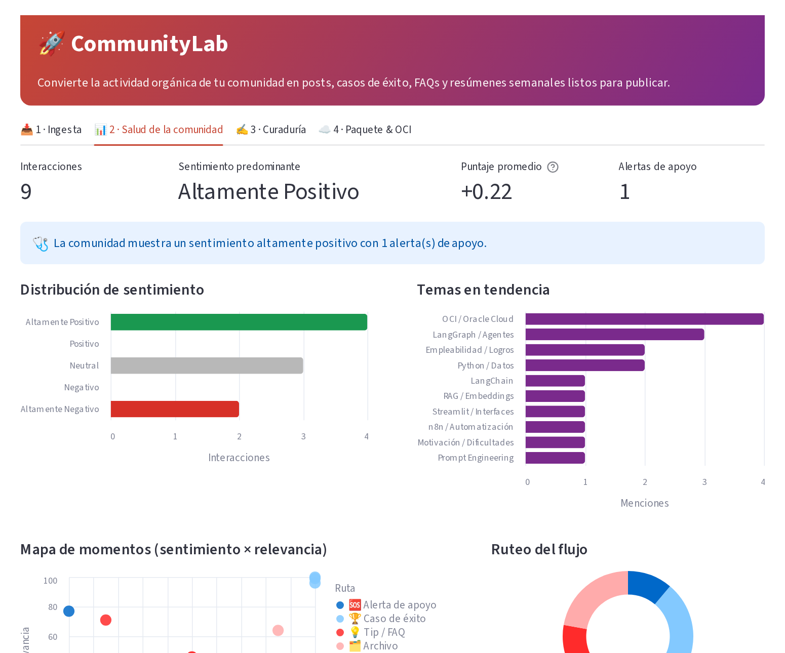
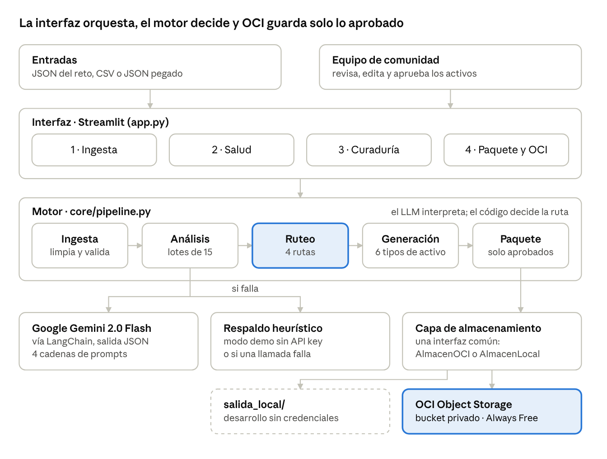
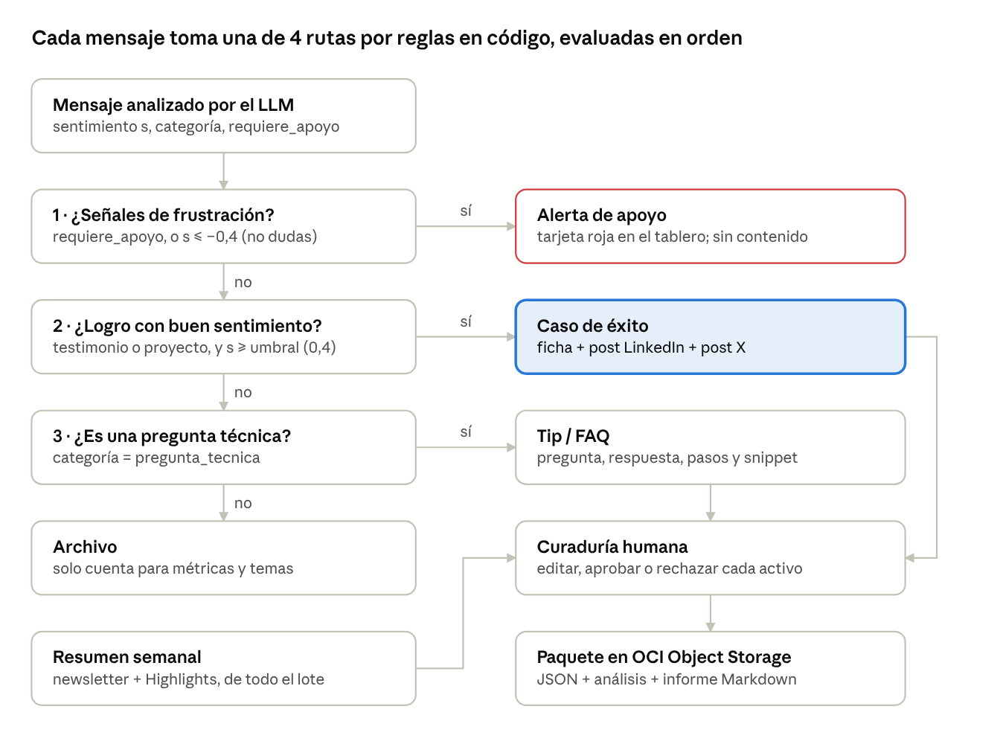
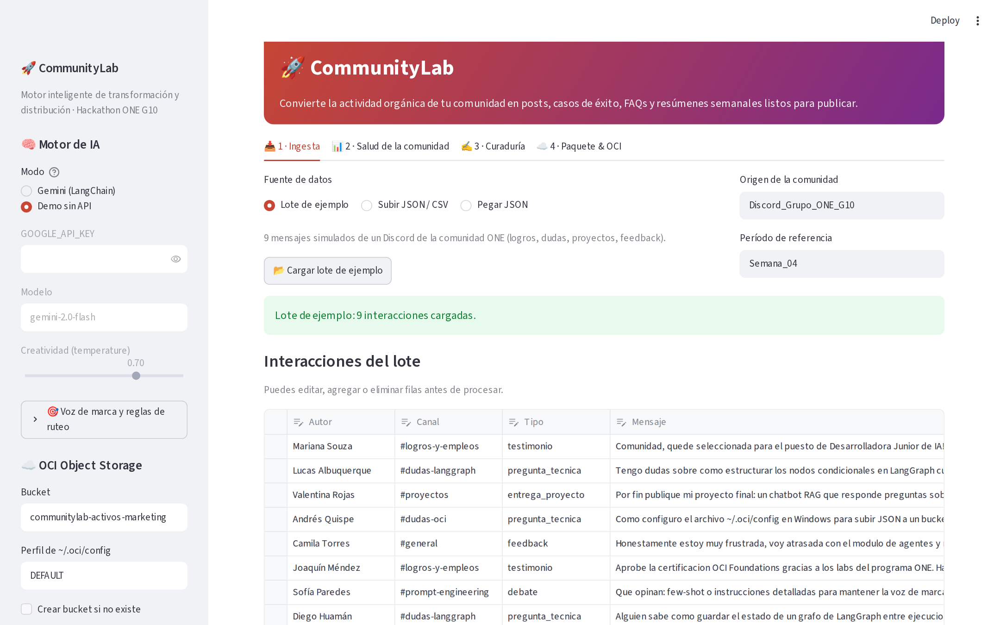
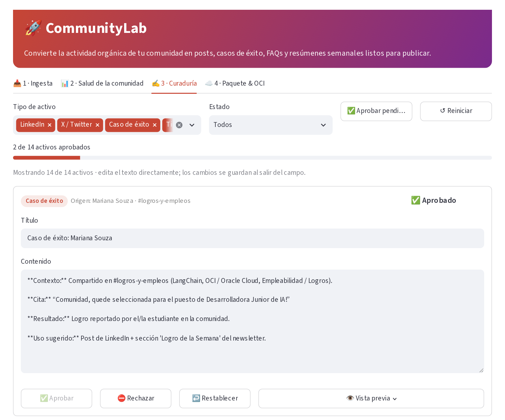
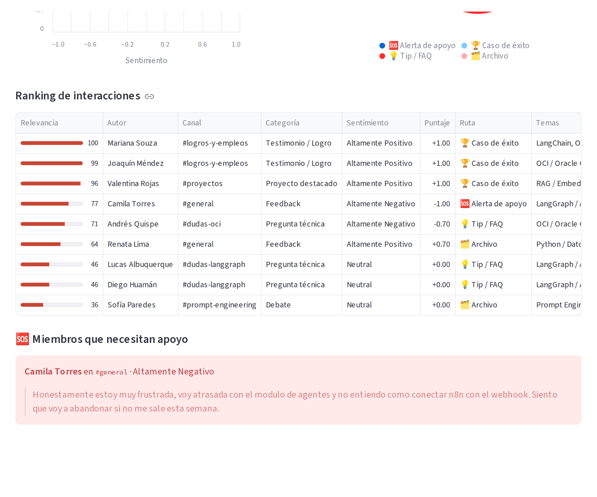
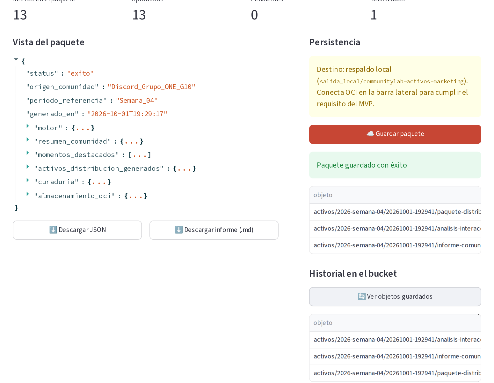

<div align="center">

# 🚀 CommunityLab

**Motor de IA que convierte las conversaciones de una comunidad tech en contenido listo para publicar.**

Ingiere un lote de mensajes, los analiza con un LLM, decide por reglas qué hacer con cada uno y genera posts, casos de éxito, FAQs y un resumen semanal que una persona aprueba antes de guardarlos en **OCI Object Storage**.


*Hackathon ONE G10 · Oracle Next Education + Alura · Reto 3*

[Case study completo](docs/CASE_STUDY.md) · [Cómo ejecutarlo](#-cómo-ejecutarlo) · [Arquitectura](#-arquitectura)



</div>

---

## 🎯 El problema

Las comunidades de aprendizaje generan cada semana testimonios, proyectos y dudas valiosas que se pierden en el historial de Discord o Slack. Encontrarlos y redactarlos para cada canal es trabajo manual que compite con todo lo demás que hace un equipo de Community Management.

CommunityLab automatiza ese trabajo **sin quitarle el control al equipo**: el LLM interpreta, el código decide y una persona aprueba.

## ✨ Qué hace

| | Funcionalidad |
|---|---|
| 📥 | **Ingesta** de JSON (formato del reto), CSV o JSON pegado, con tabla editable antes de procesar |
| 🧠 | **Análisis con LLM**: sentimiento (−1 a 1), categoría, temas, cita destacada y detección de miembros que necesitan apoyo |
| 🔀 | **Ruteo condicional** en código: caso de éxito, Tip/FAQ, alerta de apoyo o archivo |
| ✍️ | **6 tipos de activo**: post LinkedIn, post X (≤ 280), ficha de caso de éxito, Tip/FAQ, destaque de newsletter y *Community Highlights* |
| 📊 | **Tablero de salud**: sentimiento, temas en tendencia, mapa sentimiento × relevancia y ranking explicado |
| ✅ | **Panel de curaduría**: editar, aprobar, rechazar o restablecer cada activo |
| ☁️ | **Persistencia en OCI Object Storage** (Always Free), con respaldo local para desarrollar sin credenciales |
| 🛟 | **Modo demo sin API key** y degradación elegante si el LLM falla |

## 🏗 Arquitectura



La interfaz no conoce el SDK de OCI y el motor no conoce Streamlit, así que cada capa se prueba y se reemplaza por separado. El **ruteo** es la única pieza que decide qué contenido se produce, y es código determinista.

### Ruteo condicional



Las reglas se evalúan en orden de prioridad: un logro escrito con frustración se atiende antes de convertirse en publicidad. El umbral de éxito y el máximo de mensajes por ruta se ajustan desde la interfaz.

**Puntuación de relevancia** para elegir los mejores momentos de la semana:

```
Relevancia = 0.7 × relevancia_LLM (0–100) + 0.3 × |sentimiento| × 100
```

## 🖥 La interfaz

| Ingesta | Curaduría |
|---|---|
|  |  |
| **Ranking y alertas** | **Paquete y OCI** |
|  |  |

## 🧭 Decisiones de diseño

| Decisión | Por qué |
|---|---|
| Python + LangChain en vez de n8n | Un solo proceso, fácil de probar y depurar |
| El LLM clasifica, el código decide la ruta | Resultados reproducibles y auditables |
| Salida JSON estricta + saneamiento por campo | Una respuesta mal formada no rompe el lote |
| Análisis en lotes de 15 mensajes | ~15 veces menos llamadas a la API |
| Respaldo heurístico + modo demo | La demo funciona sin API key y ante fallos de red |
| Humano en el circuito | Nada se publica sin aprobación |
| Almacenamiento con interfaz común (OCI / local) | Se desarrolla sin credenciales de la nube |

Más detalle, alternativas descartadas y trade-offs en el **[case study](docs/CASE_STUDY.md)**.

## ⚡ Cómo ejecutarlo

```bat
git clone https://github.com/DiegoTCobba/desafio.git
cd desafio
python -m venv .venv
.venv\Scripts\python.exe -m pip install -r requirements.txt
copy .env.example .env            :: completa GOOGLE_API_KEY
.venv\Scripts\python.exe -m streamlit run app.py
```

> En macOS / Linux usa `source .venv/bin/activate` y `cp .env.example .env`.

Sin API key, elige **Demo sin API** en la barra lateral y carga el **lote de ejemplo** (9 mensajes).

### Configurar OCI Object Storage (Always Free)

1. En la consola de OCI: **Storage → Buckets → Create bucket** → `communitylab-activos-marketing`, tier *Standard*, sin acceso público.
2. **Perfil → API Keys → Add API Key**: descarga la llave `.pem` y pega el snippet en `%USERPROFILE%\.oci\config`.
3. En la app, pulsa **🔌 Conectar a OCI**. Con "Conectado · namespace …", el guardado va al bucket.

Cada guardado crea una carpeta con fecha y hora:

```text
activos/2026-semana-04/20261001-191500/
├── paquete-distribucion.json     # activos aprobados + resumen + metadatos
├── analisis-interacciones.json   # una fila por mensaje: ruta, puntaje, justificación
└── informe-comunidad.md          # informe legible para el equipo
```

## 🧪 Pruebas

```bat
.venv\Scripts\python.exe -m pytest tests -q
```

**19 pruebas** que no requieren API key ni OCI: ingesta, parser de respuestas del LLM, saneamiento, las 4 rutas y sus bordes, puntuación, el lote del reto de extremo a extremo, curaduría y guardado. Se ejecutan automáticamente en cada push con GitHub Actions.

## 📁 Estructura

```text
app.py                      interfaz Streamlit (4 pestañas)
core/pipeline.py            ingesta, análisis, ruteo, generación y paquete
core/prompts.py             prompts por canal, few-shot y voz de marca
core/oci_storage.py         OCI Object Storage + respaldo local
data/                       lote de ejemplo del reto (9 mensajes)
tests/test_pipeline.py      19 pruebas
docs/CASE_STUDY.md          documentación técnica completa
```

## 🗺 Roadmap

- [ ] Despliegue en OCI Compute (VM Always Free) con Docker
- [ ] Ingesta continua con webhook de Discord o n8n
- [ ] Persistir el estado de curaduría y agregar rol de aprobador
- [ ] Set de evaluación etiquetado para medir la precisión del ruteo con Gemini
- [ ] Tarjetas visuales para casos de éxito con un modelo multimodal

## 👤 Autor

**Diego** · [@DiegoTCobba](https://github.com/DiegoTCobba)

---

<sub>Proyecto desarrollado para el Hackathon ONE G10 (Oracle Next Education + Alura). Licencia MIT.</sub>
